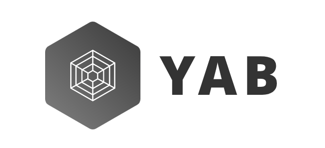

<p align="center"></p>
<div align="center">
<p>A simple fetch library.</p>
<a></a><a href="https://circleci.com/gh/mjolnirjs/yab/tree/master"></a><a href="https://codecov.io/gh/mjolnirjs/yab"></a>
</div>

---

## Introduction

Yab is a high-level HTTP client based on Fetch API and `koa-like` middlewares.

## Features

- **Middleware**: [koa](https://koajs.com/)-like middleware.
- **Fetch**: based on browser [fetch](https://developer.mozilla.org/en-US/docs/Web/API/Fetch_API/Using_Fetch) API.
- **TypeScript**: Everything in Typescript.

## Browser Support

This library can only be used in [modern browser environments](https://caniuse.com/#search=fetch). [Polyfill](https://github.com/github/fetch) may be needed.

## Install

### npm

`npm install yab-fetch`

### yarn

`yarn add yab-fetch`

### CDN

```html
<script src="https://unpkg.com/yab-fetch/dist/yab-fetch.min.js"></script>
```

## Usage

<details open>
<summary><b>Basic Usage</b></summary>

```ts
import { createYab } from "yab-fetch";

const yab = createYab();

yab.get("https://example.com");
yab.post("https://example.com");
```

</details>

<details open>
<summary><b>Middleware Usage</b></summary>

```ts
import { createYab } from "yab-fetch";
import { createCache } from "yab-fetch-cache";

const yab = createYab();

yab.use(createCache());

yab.get("https://example.com");
```

</details>

## Documents

See full documents, please read [yab-fetch](./packages/yab-fetch/README.md).

## Packages

This repository is a mono-repo that we manage using Lerna. This means we actually publish several packages to npm from the same codebase, including:

| Package                                          | Version                                                                                                                       | Description                                              |
| ------------------------------------------------ | ----------------------------------------------------------------------------------------------------------------------------- | -------------------------------------------------------- |
| [`yab-fetch`](/packages/yab-fetch)               | [](https://www.npmjs.com/package/yab-fetch)               | The fetch library.                                       |
| [`yab-fetch-cache`](/packages/yab-fetch-cache)   | [](https://www.npmjs.com/package/yab-fetch-cache)   | A yab middleware, focus on cache response using IndexDB. |
| [`yab-fetch-logger`](/packages/yab-fetch-logger) | [](https://www.npmjs.com/package/yab-fetch-logger) | A yab middleware, logger yab/response of fetch action    |


## Changelog

Detailed changes for each release are documented in [CHANGELOG.md](./CHANGELOG.md).

## Contributors

Thanks go to the wonderful people.

## License

[MIT](http://opensource.org/licenses/MIT)
